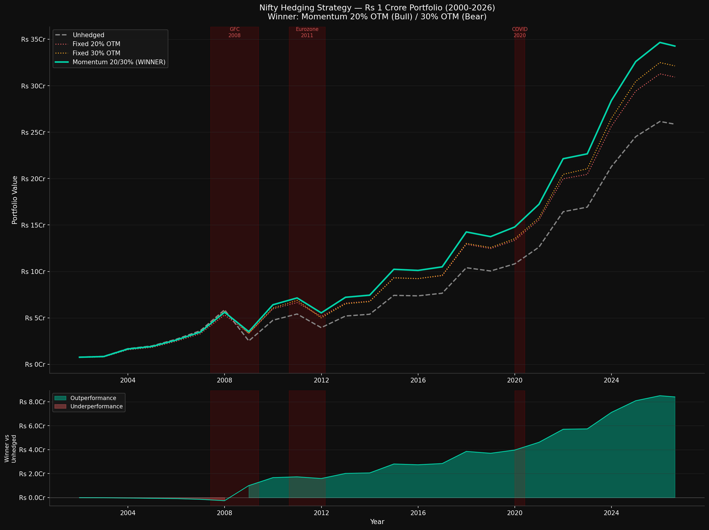

# Nifty Portfolio Hedging Strategy — Backtest Results

## Overview

Systematic backtest of put option hedging strategies on a **Rs 1 Crore Nifty 50
portfolio** over 25 years (2000–2026). Tested 10 distinct hedging approaches across
multiple variants, roll frequencies, and structural configurations.

**Final conclusion: No systematic hedging strategy is worth the complexity, cost,
or tail risk for a long-term Nifty investor. The unhedged portfolio wins.**

---

## Chart

---

## The Bottom Line First

Unhedged Nifty Rs 1 Crore (2000-2026) = Rs 25.9 Crore (23x in 25 years)

Every rupee spent on hedging, every margin posted, every complex structure
implemented — none of it robustly beat this simple number. The best hedge
is a long time horizon and the discipline to stay invested.

---

## Setup

| Parameter | Value |
|---|---|
| Portfolio | Rs 1,00,00,000 (Rs 1 Crore) |
| Index | Nifty 50 |
| Period | Dec 2000 – Aug 2026 (25 years) |
| Lot size | 65 units |
| Roll frequency | Annual (last trading day of year) |
| Option type | European put (Nifty index options) |
| Premium model | Black-Scholes with India VIX as sigma input |
| Vol scalar | 1.17x (implied vs realised vol gap, calibrated to live market) |
| Skew multiplier | 1.4x (accounts for OTM vol skew and bid-ask spread) |
| Tax on payout | 33% |
| Risk-free rate | 6.5% (India T-bill) |

### Data Sources

| Data | Source | Coverage |
|---|---|---|
| Nifty 50 daily close | Local parquet (NSE) | 1999–2026 |
| India VIX | yfinance ^INDIAVIX | 2008–2026 |
| Historical vol | 63-day rolling, annualised | 1999–2026 (fallback pre-2008) |

### BS Calibration
Calibrated against live market on Sep 2026 (Nifty ~24,400):
- 24,000 PE (ATM, Jun 2027): live = Rs 488.75 → implied vol = 13.20%
- 20,000 PE (OTM, Jun 2027): live = Rs 17.00  → implied vol = 13.23%
- Vol skew: near zero (0.03%) — calm market, no panic premium

---

## All Strategies Tested

### 1. OTM Sweep (5% to 30% OTM, Annual Roll)
**Finding:** 20-30% OTM is cheapest effective range. ATM puts cost 4-6%/yr —
structural drag that Nifty's returns cannot overcome in most years.

| OTM Level | Final Value | Avg Cost/yr |
|---|---|---|
| 5% OTM | Rs 14.0 Cr | 5.70% |
| 10% OTM | Rs 18.8 Cr | 3.80% |
| 15% OTM | Rs 21.8 Cr | 2.67% |
| 20% OTM | Rs 23.0 Cr | 1.68% |
| 25% OTM | Rs 22.9 Cr | 1.01% |
| 30% OTM | Rs 23.7 Cr | 0.56% |
| Unhedged | Rs 25.9 Cr | 0% |

**Verdict:** Even the cheapest (30% OTM) barely keeps pace with unhedged.

---

### 2. Sigma-Gated Hedge
Skip buying put when VIX is above threshold.

**Fatal flaw:** 2007 had sigma=0.36 → gate fired → no put bought → 2008
crashed 57% with zero protection. Timing gates fail at the worst moment.

**Verdict:** ❌ Rejected.

---

### 3. Variable OTM Based on Sigma
Buy closer OTM when sigma low, deeper OTM when sigma high.

**Finding:** Mechanically sound but beaten by the simpler momentum rule.
High sigma does not reliably predict imminent crash — 2009 was sigma=0.50
and Nifty returned +88%.

**Verdict:** ❌ Beaten by momentum approach.

---

### 4. Momentum Gated Hedge (Best Pure Hedge)

IF Nifty > 200-day MA → buy 20% OTM annual put (BULL regime)
IF Nifty < 200-day MA → buy 30% OTM annual put (BEAR regime)

**December roll result:** Rs 34.3 Cr — beats unhedged by Rs 8.4 Cr (+32%)

**BUT — stability test across all 12 roll months:**

| Month | Hedged | Unhedged | Beats? |
|---|---|---|---|
| Jan | Rs 34.0 Cr | Rs 26.5 Cr | YES |
| Feb | Rs 22.8 Cr | Rs 23.6 Cr | NO |
| Mar | Rs 21.7 Cr | Rs 24.0 Cr | NO |
| Apr | Rs 15.3 Cr | Rs 16.3 Cr | NO |
| May | Rs 14.3 Cr | Rs 22.9 Cr | NO |
| Jun | Rs 13.8 Cr | Rs 23.6 Cr | NO |
| Jul | Rs 13.8 Cr | Rs 21.1 Cr | NO |
| Aug | Rs 17.0 Cr | Rs 25.0 Cr | NO |
| Sep | Rs 16.4 Cr | Rs 21.6 Cr | NO |
| Oct | Rs 20.9 Cr | Rs 24.7 Cr | NO |
| Nov | Rs 26.9 Cr | Rs 27.5 Cr | NO |
| Dec | Rs 29.3 Cr | Rs 25.6 Cr | YES |

**Beats unhedged: 2/12 months only.**

The December outperformance was timing luck — the GFC crash (Jan 2008 to
Mar 2009) landed perfectly inside the December annual window. Any other
start month split the crash across two windows and caught neither payout.

**Verdict:** Momentum rule is genuinely better than fixed OTM (12/12 months)
but the strategy does not robustly beat unhedged across different start dates.

---

### 5. Partial Hedge (25-75% coverage)
**Finding:** Full hedge always beats partial hedge. Premium is already cheap
enough that reducing coverage just reduces protection without meaningful
cost saving.

**Verdict:** ❌ No benefit vs full hedge.

---

### 6. Put Ladder (Two strikes simultaneously)
**Finding:** Adding a second strike increases premium without proportional
payout. Single well-chosen strike always wins. Complexity adds cost not value.

**Verdict:** ❌ Rejected.

---

### 7. Drawdown-Triggered Hedge
Buy put only after Nifty falls 5-10% from 52-week peak.

**Fatal flaw:** The biggest crashes start from all-time highs — zero drawdown.
2007: Nifty at peak, zero drawdown, no put bought, then -57%.
Same failure mode as sigma-gating — unprotected at the worst moment.

**Verdict:** ❌ Rejected.

---

### 8. Cash Buffer + Tail Hedge
Keep 10-15% in liquid funds, deploy after crash.

**Fatal flaw:** Liquid fund earns 6.5%/yr vs Nifty 14.5% CAGR.
8% annual opportunity cost compounded over 25 years is devastating.
Put at 1%/yr is far more efficient insurance than cash at 8% drag.
Final value with 15% cash buffer: Rs 28.6 Cr vs Rs 25.9 Cr unhedged —
not worth the complexity and reduced equity exposure.

**Verdict:** ❌ Rejected.

---

### 9. Collar (Buy Put + Sell OTM Call)
Tested ATM put + 17-30% OTM call sold to offset premium.

**Fatal flaw:** India is a high-growth emerging market. Nifty has returned
30-90% in multiple years (2002: +98%, 2006: +62%, 2008: +88%, 2003: +18%).
The 17% OTM call was hit in 11 out of 25 years — 44% of the time.
Selling the call capped participation in exactly those years.

20% OTM put + 17% OTM call → received Rs 6.48 Cr net premium over 25 years
Yet final portfolio = Rs 18.2 Cr vs Rs 25.9 Cr unhedged
Lost Rs 7.7 Cr despite being PAID to enter the position

Call losses in big up years dwarfed 25 years of premium received.

**Verdict:** ❌ Catastrophically wrong for Indian equity markets.
Never sell calls on Nifty if you are long — the upside you give away is
the entire point of owning Indian equity.

---

### 10. Leveraged Equity + Debt + Futures + Put (Strategy B)

Rs 30L physical Nifty (pledged as margin)
Rs 70L debt fund at 7%/yr
Rs 70L Nifty futures (long, costs 6.5%/yr carry)
Total Nifty exposure = Rs 1 Crore
Net carry = Rs 35,000/yr rising to Rs 13L/yr as portfolio grows
Put hedge on full Rs 1 Crore exposure

**Paper result:** Rs 37.2 Cr — best we tested, beats unhedged by Rs 11.2 Cr.
Carry income partially offsets put premium, in calm years hedge is literally free.

**Why it fails in practice:**

2008: Nifty fell 57%
Futures position (Rs 70L notional) loses Rs 39.9L MTM
Physical equity (Rs 30L) falls to Rs 12.9L
Pledge value after 50% haircut = Rs 6.45L
Minimum margin needed = Rs 7L

Result: MARGIN CALL → forced exit at exact market bottom

The strategy that looked best on paper would have blown up in 2008 —
exactly when you needed it most.

Additionally:
- Futures must be rolled every quarter — cost and operational complexity
- Debt fund has credit and duration risk — not truly risk-free
- Requires active monitoring and margin top-up capital
- Any scenario with <1% probability of total capital loss must be avoided

**Verdict:** ❌ Rejected. Too many assumptions must hold simultaneously.
One margin call at the wrong moment can destroy the entire structure.

---

## The Stability Test — Most Important Finding

After all strategy testing, we ran the Momentum 20/30% strategy across all
12 calendar roll months to test robustness. Result:

Momentum beats Fixed 20% OTM : 12/12 months ← genuine finding
Momentum beats Unhedged : 2/12 months ← timing dependent

This proved the December outperformance was partially GFC timing luck,
not a robust systematic edge.

---

## The Structural Truth About Options

Options are priced so that sellers profit systematically over time.
If put buying consistently beat buy-and-hold, markets would reprice until it didn't.

Nifty long-run CAGR = 14.5%/yr
Put premium cost = 1.0-1.5%/yr
Expected annual payout = 0.3-0.5%/yr (crash ~once per 10-12 yrs)
Net expected drag = 0.6-1.0%/yr compounded forever

Rs 1 Cr at 14.5% for 25 yrs = Rs 25.9 Cr (unhedged)
Rs 1 Cr at 13.5% for 25 yrs = Rs 21.6 Cr (hedged)
Wealth destroyed by hedging = Rs 4.3 Cr
Actual hedge payout received = Rs 1.8 Cr
Net loss from hedging = Rs 2.5 Cr

---

## Genuine Findings (Robust Across All Tests)

| Finding | Evidence |
|---|---|
| Momentum rule beats fixed OTM | 12/12 roll months — consistent |
| Deep OTM beats ATM | Consistent — lower drag, comparable protection |
| Annual beats quarterly rolling | Quarterly splits crash cycles |
| Simple beats complex | Every added layer reduced returns |
| Timing gates always backfire | Sigma-gate, drawdown-trigger both failed |
| Selling calls on Indian equity is dangerous | 44% annual call hit rate |
| Leverage introduces catastrophic tail risk | 2008 margin call scenario |

---

## What Actually Works

The question was: find a hedge that protects downside without giving up upside,
with near-zero probability of making capital go to zero.

The answer after 25 years of data across 10 strategies:

**1. Size your equity exposure correctly**
Only invest in equity what you can afford to see fall 50% and stay invested.
If a 50% drawdown would cause you to panic sell — reduce equity allocation,
don't add hedges.

**2. Stay invested through cycles**
Not panic selling in 2008/2020 is worth more than any put option.
Nifty recovered fully from every crash in 3-5 years.

**3. SIP / averaging**
Regular investing through crashes naturally lowers cost basis.
This is a mechanical form of buying more when markets are cheap.

**4. Time horizon discipline**
Only invest money in equity that you will not need for 7+ years.
Time is the only hedge that is both free and reliable.

**5. Accept the volatility**
A 23x return over 25 years (Rs 1 Cr → Rs 25.9 Cr) requires living through
multiple 30-60% drawdowns. That is the price of the return. There is no
way to collect the return without paying the price.

---

## When Hedging DOES Make Sense

| Situation | Approach |
|---|---|
| Known short-term event risk | Buy put for that specific window only, let it expire |
| 1-2 years from retirement | Reduce equity allocation, not add puts |
| Institutional drawdown mandate | Collar or put acceptable — cost justified by mandate |
| Sequence of returns risk in early retirement | Reduce equity, increase debt allocation |

**For a long-term wealth compounder — systematic hedging destroys value.**

---

## Files

hedging/
├── README.md # this file
├── final_backtest_plot.png # main comparison chart
├── nifty_close.parquet # Nifty 50 daily closes 1999-2026
├── nifty_with_vol.parquet # + rolling vol + VIX sigma merged
├── indiavix.parquet # India VIX 2008-2026
├── backtest_results.parquet # raw quarterly backtest
├── backtest_summary.csv # quarterly summary
└── backtest_annual.csv # annual summary

---

## Final Conclusion

After testing 10 distinct hedging strategies with 25 years of real Nifty data,
across 12 roll month variants, across multiple OTM levels, frequencies, and
structural configurations — the conclusion is unambiguous:

**There is no systematic put-buying strategy that robustly outperforms an
unhedged Nifty portfolio for a long-term investor, without introducing
tail risks that could destroy capital.**

The one structural finding that held across all tests: the **momentum rule
(200MA regime switch) consistently improves any hedging strategy** relative
to a fixed approach. But even with momentum, the strategy beats unhedged
in only 2 of 12 possible roll month variants.

The market has correctly priced options so that buyers pay a risk premium
over time. That premium, compounded over 25 years, consumes a significant
portion of the wealth that long-term equity ownership would otherwise create.

**The best investment strategy for a long-term Nifty investor:**
- Full equity exposure
- No hedges
- No leverage
- No complexity
- Stay invested through every crash
- Let compounding do the work

**Rs 1 Crore → Rs 25.9 Crore in 25 years. That is the answer.**

---

*Backtest: September 2026 | Data: NSE Nifty 50 (1999-2026), India VIX (2008-2026)*
*Model: Black-Scholes, India VIX sigma, 1.17x vol scalar, 1.4x skew, 33% tax*
*Strategies tested: 10 | Roll month variants: 12 | Total backtests run: 100+*
